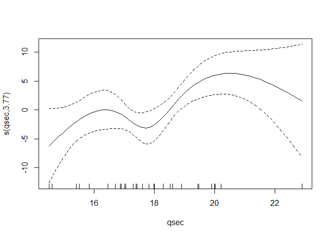
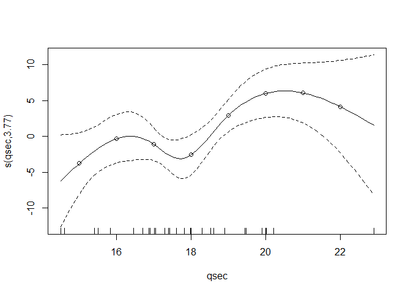

<!-- README.md is generated from README.Rmd. Please edit that file -->

# gam2formula

<!-- badges: start -->

<!-- badges: end -->

The `gam2formula` package converts spline smooths from generalized
additive models fitted with `mgcv` into closed-form algebraic formulas
that can be printed, exported to LaTeX, and predicted from.

## Installation

You can install the current version of `gam2formula` with:

``` r
remotes::install_github("iqtigorg/gam2formula")
```

## Example

Fit a spline in a generalized additive model using `mgcv`:

``` r
library(mgcv)
m <- gam(mpg ~ s(qsec, bs = "cr", k = 5), data = mtcars)
plot(m)
```



Display the algebraic formula of a spline as coefficient table using
`gam2formula` :

``` r
library(gam2formula)
mod_formulas <- gam2formula(m)
print(mod_formulas, term = "qsec")
#> # A tibble: 7 × 4
#>   term  range bfun                          coef
#>   <chr> <chr> <chr>                        <dbl>
#> 1 qsec  1     1                            10.2 
#> 2 qsec  1     (qsec-14.5)/8.4               8.42
#> 3 qsec  1     abs((qsec-14.5)/8.4)^3     -140.  
#> 4 qsec  1     abs((qsec-16.8775)/8.4)^3  1382.  
#> 5 qsec  1     abs((qsec-17.71)/8.4)^3   -2057.  
#> 6 qsec  1     abs((qsec-18.8275)/8.4)^3   867.  
#> 7 qsec  1     abs((qsec-22.9)/8.4)^3      -51.5
```

And use the formula for point predictions, independent of the original
model object:

``` r
plot(m)
points(15:22, predict(mod_formulas, term = "qsec", newdata = data.frame(qsec = 15:22)))
```



For further examples and documentation, see our
[vignette](inst/doc/using-gam2formula.pdf).
