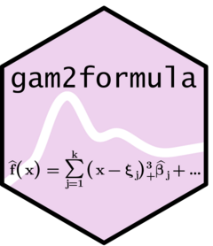
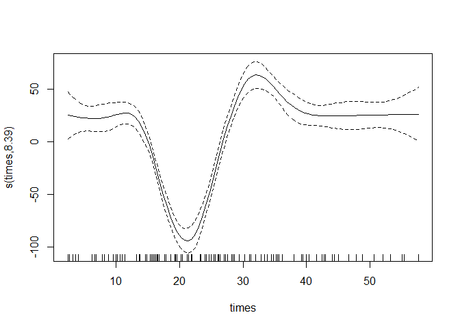
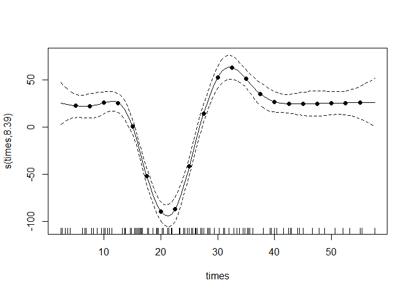

<!-- README.md is generated from README.Rmd. Please edit that file -->

# gam2formula 

<!-- badges: start -->

[](https://github.com/iqtigorg/gam2formula/actions/workflows/R-CMD-check.yaml)
[](https://app.codecov.io/gh/iqtigorg/gam2formula)
[](https://lifecycle.r-lib.org/articles/stages.html#experimental)
<!-- badges: end -->

## Description

The `gam2formula` package converts spline smooths from generalized
additive models fitted with `mgcv` into closed formulas that can be
printed, exported to LaTeX, and predicted from.

## Background

The popular `mgcv` package allows estimating smooth effects for
continuous predictor variables in a generalized additive mixed model
framework, providing a variety of smoothers with penalized likelihood
maximization (Wood, 2017). Yet, there is currently no easy-to-use
functionality in the `R` ecosystem for the estimated smooth effect in
terms of the original predictor variable. Instead, plotting and
predictions require `mgcv`’s fitted model object. This limits
transparency and reproducibility in many applications.

The `gam2formula` package fills this gap for many common smoothers from
`mgcv`, including B-spline, P-spline and cubic regression spline
smooths. The derivation is exact and relies on a change of basis of the
internally used empirically centered basis functions.

Hence, users can overcome typical barriers for the use of advanced
smoothing methods in applications that require a high degree of
transparency (e.g., the detailed reporting of regression coefficients)
and reproducibility (e.g., the computation of predictions independent of
access to training data; the transfer of prediction models between
software platforms). By exposing the expressions behind the prediction
machinery, the package can also support educators who teach
semi-parametric modeling of smooth effects.

## Installation

You can install the current version of `gam2formula` with:

``` r
pak::pak("iqtigorg/gam2formula")
```

## Example

Fit a spline in a generalized additive model using `mgcv`:

``` r
library(mgcv)
library(MASS)
m <- gam(accel ~ s(times, bs = "cr"), data = mcycle)
plot(m)
```



Display the closed formula of a spline as coefficient table using
`gam2formula`:

``` r
library(gam2formula)
mod_formulas <- gam2formula(m)
print(mod_formulas, term = "times")
#> # A tibble: 12 × 4
#>    term  range bfun                                      coef
#>    <chr> <chr> <chr>                                    <dbl>
#>  1 times 1     1                                        22.2 
#>  2 times 1     (times-2.4)/55.2                        -27.0 
#>  3 times 1     abs((times-2.4)/55.2)^3                1779.  
#>  4 times 1     abs((times-9.06666666666667)/55.2)^3 -21164.  
#>  5 times 1     abs((times-14.7333333333333)/55.2)^3  71061.  
#>  6 times 1     abs((times-17.8)/55.2)^3             -38694.  
#>  7 times 1     abs((times-22.4)/55.2)^3             -51015.  
#>  8 times 1     abs((times-26.3333333333333)/55.2)^3  28623.  
#>  9 times 1     abs((times-31.2)/55.2)^3              26924.  
#> 10 times 1     abs((times-36.8)/55.2)^3             -20581.  
#> 11 times 1     abs((times-44.2666666666667)/55.2)^3   3065.  
#> 12 times 1     abs((times-57.6)/55.2)^3                  1.50
```

And use the formula for point predictions, independent of the model
object:

``` r
plot(m)
x <- seq(5, 55, 2.5)
points(x, predict(mod_formulas, term = "times", newdata = data.frame(times = x)), pch = 16)
```



For further examples and documentation, see our
[vignette](inst/doc/using-gam2formula.pdf).

# References

Wood, S.N. (2017) Generalized Additive Models: An Introduction with R
(2nd edition). Chapman and Hall/CRC.
